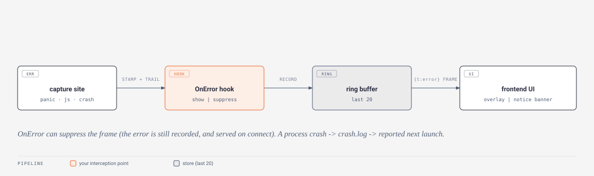

# Errors and crash handling

Gantry ships with crash detection on by default. A React render crash shows an error screen instead of a white window; a Go panic in a handler surfaces in the frontend instead of vanishing into a log line; even a hard process crash leaves a trace that the next launch reports. Every captured error carries the page the user was on and a breadcrumb trail of the actions that led there, so a report reads as a story ("was on /settings, clicked save, auth.login failed, then the panic") rather than a bare stack. Everything is interceptable and replaceable per app, on both the Go and the React side. The Go half lives in `ui/errors.go` (capture, ring buffer, hook) and `gantry/errors.go` (`gantry.Go`, the crash log, the HTTP recover wrapper); the React half in `web/src/errors.ts`.



## What gets caught

| Kind | Code | What happened | Result |
| --- | --- | --- | --- |
| `react-render` | `react.render` | a page/component threw during render | full-screen error overlay (the window chrome keeps working - drag and close stay alive) |
| `js-error` | `js.error` | an uncaught JS exception (`window.error`) | notice banner in development, console in production |
| `js-rejection` | `js.rejection` | an unhandled promise rejection | notice banner in development, console in production |
| `call-panic` | `panic.call` | a Go call handler panicked | the awaiting call rejects with the code, plus a notice banner |
| `event-panic` | `panic.event` | a paired event handler panicked | notice banner |
| `cmd-panic` | `panic.cmd` | a Tea command goroutine panicked | notice banner |
| `tea-update-panic` | `panic.update` | a Model's Update panicked | model keeps its last good state, notice banner |
| `tea-view-panic` | `panic.view` | a Model's View panicked | last good render stays up, notice banner |
| `http-panic` | `panic.http` | an /api handler panicked | coded 500 JSON response (`{"error":...,"code":"panic.http"}`), plus notice banner |
| `goroutine-panic` | `panic.goroutine` | a `gantry.Go(fn)` goroutine panicked | app stays alive, notice banner |
| `process-crash` | `panic.fatal` | an uncatchable crash killed the process | trace lands in crash.log; the next launch reports it |

The `kind` string names the capture site; the `code` is its stable `gerr` code. JS-side errors (`react.render`, `js.error`, `js.rejection`) are also reported back to Go via `call("gantry","reportError")`, so the `gantry dev` terminal, the error ring buffer and the app's `OnError` hook see every error from both sides through one pipeline.

## The pipeline

Every capture flows through `App.ReportError` (`ui/errors.go`):

```
capture site -> stamp page + breadcrumb trail -> app's error hook -> ring buffer (last 20) -> {"t":"error"} websocket frame -> the frontend error UI (built-in or custom)
```

The order is deliberate: the hook runs before the push and can strip the stack or suppress the frame, but the error still lands in the ring buffer either way (a suppressed error is still recorded). The ring buffer holds the last **20** errors (`maxErrors`) and is served to the frontend by `call("gantry","errors")` - which is how errors that fired while disconnected, and last-run crashes, still reach a freshly connected client. The breadcrumb trail is the last **50** actions (`maxCrumbs`) and records itself automatically from the websocket traffic: page navigations (`navigate`), Tea and paired events (`event`), service calls with their ok/err outcome (`call`), and state writes (`state`). Calls to the built-in `gantry` service are not trailed (they are framework noise). Add your own lines with `App.Breadcrumb("sync started")` in Go or `addBreadcrumb("import chosen")` from React (both record a `custom` crumb).

## The built-in error UI

There are two severities. A **fatal** error - only `react-render` - takes over the content area: in development you get the message, the JS and component stacks, the page, a "What led here" timeline and a Reload button; in production, a friendly "Something went wrong" card with Reload. A **notice** (Go panics, unhandled rejections - the app is still alive) is a dismissible banner. The frontend dedupes the same `message`+`stack` within a 500ms window (StrictMode and error bubbling can fire one error twice). The window chrome sits outside the error boundary on purpose: a crashed page can always still be dragged and closed.

## Intercepting in Go

`Config.Errors` (`gantry.ErrorOptions`) is the app's hook into the pipeline:

```go
gantry.Run(gantry.Config{
    // ...
    Errors: gantry.ErrorOptions{
        OnError: func(e gantry.ErrorInfo) gantry.ErrorAction {
            // e.Kind, e.Code, e.Message, e.Stack, e.Page, e.Trail
            saveToMyLog(e)
            if e.Kind == "call-panic" {
                myState.Set("showError", true)  // drive your own UI instead
                return gantry.ErrorSuppress      // keep it off the built-in screen
            }
            return gantry.ErrorShow
        },
        OmitStacks: false, // true strips e.Stack before it reaches the frontend
        Disable:    false, // true turns the whole pipeline off
    },
})
```

`OnError` returns `ErrorShow` (the default, also when `OnError` is nil) to let the built-in handling run, or `ErrorSuppress` to keep the error off the frontend and handle it yourself. Suppressed errors stay in the ring buffer, so `call("gantry","errors")` still returns them. `OmitStacks` blanks `Stack` for every error (they only ever travel the local-only websocket, but paranoid production apps can opt out); `Disable` skips recording, pushing, and even the crash-log setup - recovered panics still log to the terminal. For background work you start yourself, prefer `gantry.Go(fn)` over a bare `go func()`: it recovers a panic into the pipeline as `goroutine-panic` instead of letting it kill the process.

## Intercepting in React

`createApp` (usually via the root `app.tsx`) takes an `errors` option (`ErrorHandlingOptions`):

```tsx
export default {
  errors: {
    screen: MyErrorScreen,          // replace the built-in UI (receives ErrorScreenProps)
    onError: (e) => {               // intercept every error
      track(e);
      return false;                 // false suppresses the default UI
    },
    showGoErrors: "development",    // Go panic banners: true | false | "development" (default)
    reportToGo: true,               // send JS errors to the Go side (default)
    enabled: true,                  // false restores the old white-screen behavior
  },
} satisfies CreateAppOptions;
```

A custom screen receives `{ error, mode, variant, onDismiss }` - render whatever fits the app. `showGoErrors` gates whether Go-side panic notices show at all; with the `"development"` default they show in dev and log to the console in production. `useGantryErrors()` exposes the error store (`{ fatal, notices }`) directly for fully custom arrangements. Each `GantryErrorInfo` also carries `origin` (`"go"` | `"js"`) and, for render crashes, `componentStack`.

## Uncatchable crashes

Go cannot recover a panic on a goroutine it did not wrap: a bare `go func()` that panics kills the process, and no hook can run in that moment. What Gantry does instead: at startup `setupCrashLog` points the runtime's fatal-trace output (`debug.SetCrashOutput`) at `<user config dir>/<app>/crash.log` (so the trace survives even in windowed builds with no console), truncating any previous trace as it is consumed. On the next launch, a waiting trace is reported through the normal pipeline as `process-crash` / `panic.fatal` - your `OnError` hook runs, and the frontend shows a "crashed last run" notice with the full trace in development. It is recorded, not live-pushed: the frontend picks it up from `call("gantry","errors")` on connect. The trail is empty for these, because the process died before it could be snapshotted.

## Coded errors (gerr)

Framework and CLI errors carry stable, greppable codes - `config.bad-arg-spec`, `panic.call`, `dev.vite-start` - via the `gerr` package (`gerr/gerr.go`). A `*gerr.E` is a normal Go error wrapping a `Code`, a message, an optional `Hint`, and an optional cause:

```go
import "github.com/BlueBeard63/Gantry/gerr"

return nil, gerr.New("auth.expired", "session expired").WithHint("log in again")
```

An error a call handler **returns** is control flow, not a crash: it rejects the awaiting frontend call (never the error screen), and its code travels with it - `GantryCallError.code` on the rejection, `code` on `useCall` results - so the frontend can switch on `"auth.expired"` instead of string-matching messages (see [the wire protocol](protocol.md) for the reply frame). `gerr.CodeOf(err)` reads a code back out of any wrapped error chain (`errors.As` walks through `*E`), and `gerr.HintOf` reads the hint.

### Code reference

The codes the framework and CLI actually mint:

| Code | Meaning |
| --- | --- |
| `config.not-found` | no gantry.json here or in any parent |
| `config.parse` | gantry.json is not valid JSON |
| `config.bad-arg-spec` | an `args` declaration is invalid (name, reserved name, type, default or env) - see [Args](args.md) |
| `dev.vite-start` | `gantry dev` failed to start the Vite dev server |
| `dev.go-start` | `gantry dev` failed to start `go run` |
| `test.bad-mode` / `test.bad-device` / `test.no-tests` / `test.no-mobile` / `test.no-toolchain` / `test.no-report` / `test.failed` | `gantry test` failures (bad `--mode`/`--device`, nothing to run, missing mobile config or toolchain, missing report, failing tests) |
| `panic.call` / `panic.event` / `panic.cmd` / `panic.update` / `panic.view` | a recovered Go panic (see the kinds table) |
| `panic.http` / `panic.goroutine` / `panic.fatal` | HTTP handler panic, `gantry.Go` panic, process crash |
| `js.error` / `js.rejection` / `react.render` | frontend-side captures |

Apps are encouraged to mint their own codes in the same `category.name` shape for the errors their handlers return.
