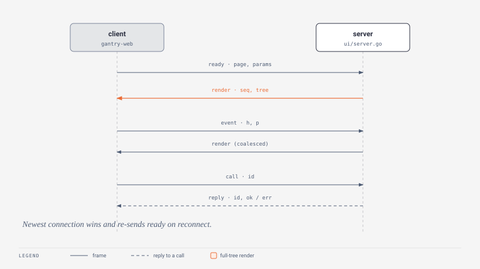

# The wire protocol

What travels over `/gantry/ws`, the app-level transport described in [Architecture](architecture.md). You never speak this by hand - `gantry-web` (`web/src/socket.ts`) does on the client, `ui/server.go` does on the server - but knowing it makes debugging in the network tab trivial. All messages are **JSON** text frames with a `"t"` discriminator. The Go structs are `clientMsg`, `renderMsg`, `pushMsg`, `replyMsg`, `stateMsg` in `ui/server.go`.



## Client -> server

```json
{"t":"ready","page":"pages/index","params":{"id":["7"]}}
```

Sent when a page mounts, and again on every reconnect. The server moves render delivery to this page, activates its Model (starting the program on first mount, re-attaching after), records the params, and a full render comes back. `params` normalizes every route param to an array on the wire (`map[string][]string`): a `[id]` value is a one-element array `["7"]`, a `[...slug]` catch-all keeps all its segments. The server hands them to the Model as `ParamsMsg` and exposes them via `App.Params()`/`App.Param()` - see [Dynamic routes](../ui/dynamic-routes.md). A `ready` for a page already active is a reconnect and is not recorded as a navigation crumb.

```json
{"t":"event","h":"h42","p":123}
```

A Tea event: `h` is the handler id from the current render tree, `p` the payload (button clicks send none, inputs send the value). The server resolves `h` against the current, then the previous, handler generation (see below).

```json
{"t":"event","key":"pages/index","name":"buttonPress","p":{"n":3}}
```

A paired event: `key` names the pair (page or component key), `name` the handler in its `ui.Handlers` (`Page.On` / `Component.On`), `p` the payload. Fire-and-forget - no reply. A handler panic is recovered and reported as `panic.event`; an unresolved key/name logs on the Go side.

```json
{"t":"call","key":"auth","name":"login","id":"c3","p":{"user":"jack"}}
```

An **awaited call** (`usePaired().call`, `useService`, `useCall`). `key` resolves in order: page key, component key, then **service name** (`app.Service`). `name` is the entry in that group's `ui.Calls`. `id` (`"c" + counter`) correlates the reply. The call runs on its own goroutine off the read loop, so slow calls never block other traffic.

```json
{"t":"setstate","key":"volume","p":0.8}
```

A frontend write to a shared state variable (`useGoState`). Not echoed back to the sender - it already applied locally. The server stores it, runs the state's `OnChange` watchers, and mirrors it to every OTHER connected client (so an observer sees one state timeline). An unknown key is dropped with a log line.

## Server -> client

```json
{"t":"render","seq":7,"tree":{"type":"column","children":[...]}}
```

A full Tea render for the active page. `seq` (`uint64`) increases per connection; `tree` is the serialized `View()`. Each node is a `wireNode`:

```json
{
  "type": "button",
  "key": "save-btn",
  "props": {"label": "Save"},
  "handlers": {"click": "h43"},
  "children": []
}
```

`type` is the node kind, `props` its serialized properties, `handlers` maps event name to the handler id assigned this render generation, `children` the nested nodes. `key` is optional. Empty maps/slices are omitted.

```json
{"t":"push","key":"components/gauge","name":"state","p":{"value":0.7}}
```

A paired push from `App.Push(key, event, payload)`. On the client, pushes named `state` feed `usePaired().state`; every other name goes to `on()` subscribers for that key. No-op when no client is connected - pushes are not queued for a dead client.

```json
{"t":"reply","id":"c3","ok":true,"p":{"name":"jack"}}
{"t":"reply","id":"c3","ok":false,"err":"bad password","code":"auth.expired"}
```

The answer to a call: it **resolves** (`ok:true`, value in `p`) or **rejects** (`ok:false`) the awaiting promise. A rejection carries `err` (the error message) and, when the returned error has one, `code` - the `gerr` code (`gerr.CodeOf(err)`), or the literal `"panic.call"` for a panicked handler. The client surfaces both as `GantryCallError.message` / `GantryCallError.code` (and `useCall`'s `code`), so the frontend can switch on `"auth.expired"` instead of string-matching. A call with no matching handler replies `ok:false` with `err` "no call ..." and no code. The client times a call out after **30 seconds** with a local `Error` (not a `GantryCallError`) if no reply lands. See [Errors](errors.md) for how codes flow.

```json
{"t":"error","p":{"kind":"call-panic","code":"panic.call","source":"pages/index.save","message":"boom","stack":"...","time":"...","page":"pages/index","trail":[{"time":"...","type":"event","detail":"pages/index.increment","ok":true}]}}
```

A captured Go-side error (`ErrorInfo`): a recovered panic, or a crash recovered from the previous run. `p` carries `kind`, `code`, `source`, `message`, `stack`, `time`, the `page` the user was on, and the breadcrumb `trail` (each `Crumb` is `time`/`type`/`detail`/`ok`). It drives the frontend error UI. Last-run crashes are NOT pushed live - they are recorded and fetched via `call("gantry","errors")` on connect. See [Errors](errors.md) for the full pipeline and code table.

```json
{"t":"state","key":"volume","p":0.8}
```

A shared state value (`ui.NewState` / `useGoState`): sent for every declared state when a client connects (`snapshotStates`), then on every Go-side `Set`, and mirrored to other clients on a frontend `setstate`.

## Semantics worth knowing

- **One real client, plus observers.** A new non-observer connection becomes THE client; the server detaches and closes the predecessor (status "replaced"). This is what makes webview reloads, React StrictMode's double mount, and dev restarts all Just Work - the newest connection wins and re-announces its page with `ready`. `?observer=1` connections are additional read-write taps that never displace the real client; every outbound frame fans out to them.
- **Whole-tree renders, coalesced.** Every Update sends the full tree - there is no diffing. The program's loop drains all queued messages before rendering, so a burst of rapid events produces one render, and the newest state wins.
- **Handler generations.** Each render assigns fresh handler ids (`h1`, `h2`, ... monotonically per program). The server keeps exactly one previous generation (`prev`), so an event racing a re-render (you clicked while the tree was being replaced) still resolves against the old id. Ids older than that are dropped silently - by design, since their meaning is gone.
- **Reconnect.** The client retries with backoff starting at 300ms, doubling to a 5s cap, and re-sends `ready` (with its params) on each connect; the server responds with a fresh render. A `setstate`/`call`/event issued while the socket is down is queued and flushed on reconnect (`sendQueue`); pushes for a disconnected client are dropped - treat `Push` as UI mirroring, not a message queue.
- **Keepalive.** The server sends a websocket ping every 30 seconds.

## Debugging

Set `WindowOptions.Debug = true`, open devtools in the window, and watch the WS tab: every render, event, push, reply, state and error frame is right there. On the Go side, unresolved paired events and calls, unusable state values, and recovered panics all log with the exact key/name that missed.
