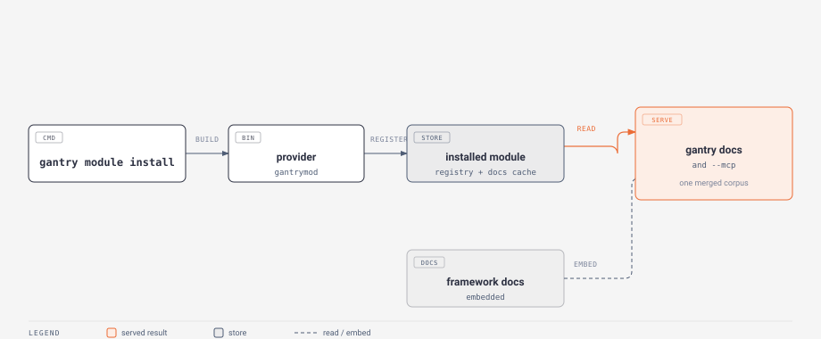

# Module commands

Gantry modules are out-of-tree Go modules that extend the framework. A module can ship documentation that merges into `gantry docs`, a Go library your apps import, and (later) its own CLI subcommands. The `gantry module` group installs, lists and removes them. Every command parses its flags with Go's standard `flag` package, so a flag accepts both `-flag` and `--flag`. Installed modules are recorded in a registry under your user config directory (`gantry/modules.json`), and each module's provider binary and cached docs live under your user cache directory (`gantry/modules/<namespace>@<version>/`), so removing a module is a clean directory delete.

The first module to reach for is [WhiteGantry](https://github.com/BlueBeard63/WhiteGantry), which lets a Gantry app integrate with the WhiteFlower desktop.



## gantry module install

Installs a module: it fetches or builds the module's provider command, reads what the module offers, registers it, and caches its docs so they show up in `gantry docs`. When the module ships a library and you run the command inside an app, it offers to add that library to your `go.mod`.

```
gantry module install <module>[@version] [flags]
gantry module install <local-dir> [flags]
```

Give a module path to install a published module, optionally pinned with `@version` (`@latest` is the default, and `@v1.2.3`, `@branch` and `@commit` all work). Under the hood this runs `go install`, so a private module installs the same way any private Go module does: make sure your git credentials are set up and that `GOPRIVATE` covers the module's owner. If a private fetch fails and the owner is not yet in `GOPRIVATE`, the command offers to add it for you and retries.

Give a local directory instead (an argument starting with `.`, `/` or `~`, or any path that resolves to a directory) to build a module straight from source with `go build`, honoring your `go.mod` and any `replace` directives. This is the authoring loop: install a module you are working on and preview its docs before you publish it.

Flags:

- `--version V` (string, default: "") - the version to install, an alternative to writing `@version` in the module argument. Ignored for a local directory.
- `--project` / `--no-project` (bool) - when run inside an app, whether to also `go get` the module's library into that app's `go.mod`. Without either flag the command asks; with no terminal attached it leaves `go.mod` untouched.
- `--reinstall` (bool, default: false) - reinstall even when the same version is already registered.
- `--no-goprivate` (bool, default: false) - do not offer to edit `GOPRIVATE` on a private-access failure.
- `--json` (bool, default: false) - print the result as JSON.

## gantry module list

Lists the installed modules as a table of namespace, title, source, version and capabilities, plus whether a newer version is available (a once-a-day, best-effort check against the module proxy that stays quiet when offline).

```
gantry module list [flags]
```

Flags:

- `--json` (bool, default: false) - print the registry as JSON.
- `--outdated` (bool, default: false) - show only modules with a newer version available.
- `-v` (bool, default: false) - add the provider binary path, install time and docs route prefix.

## gantry module uninstall

Removes a module: it drops the registry entry, deletes the cached docs and provider binary, and leaves the shared Go module cache alone. When run inside an app that imports the module's library, it offers to drop that dependency too.

```
gantry module uninstall <name | namespace | source> [flags]
```

The argument matches by module source path, then by namespace, then by a case-insensitive title, then by an unambiguous prefix of any of those. An ambiguous argument lists the candidates instead of guessing.

Flags:

- `--project` / `--no-project` (bool) - when run inside an app that requires the library, whether to also remove it from `go.mod` (`go get <import>@none` then `go mod tidy`). Without either flag the command asks.
- `--json` (bool, default: false) - print the removed module as JSON.

## gantry module update

Reinstalls a module at its latest version and re-pulls its docs. With no name it updates every installed module.

```
gantry module update [<name>]
```

## gantry module info

Prints one module's details: its module path, installed version, capabilities, docs route prefix, library import path, provider binary and install time.

```
gantry module info <name | namespace | source>
```

## Where the docs go

A module that ships docs mounts its pages under `/<namespace>` in the viewer and in [`gantry docs --mcp`](mobile-and-docs.md#the-mcp-server), so `gantry module install` followed by `gantry docs <topic>` (or a coding agent's `search_docs`) finds them alongside the framework docs. A running MCP server picks up a newly installed module the next time it starts.

## Writing a module

A Gantry module is an ordinary Go module with three things: an installable provider command (put it at `<module>/gantrymod`) whose `main` is one line, a `gantry-module.json` describing the module, and a `docs/` tree.

```go
package main

import (
	"embed"

	"github.com/BlueBeard63/Gantry/gantrymodule"
)

//go:embed gantry-module.json
var manifest []byte

//go:embed all:docs
var docs embed.FS

func main() { gantrymodule.Main(manifest, docs) }
```

The `gantry-module.json` names the module and lists what it provides (validated against [gantry-module.schema.json](https://raw.githubusercontent.com/BlueBeard63/Gantry/main/gantry-module.schema.json)):

```json
{
  "namespace": "whitegantry",
  "title": "WhiteGantry",
  "module": "github.com/BlueBeard63/WhiteGantry",
  "version": "v0.1.0",
  "provides": {
    "docs": { "prefix": "/whitegantry" },
    "lib": { "import": "github.com/BlueBeard63/WhiteGantry" }
  }
}
```

The `docs/` tree holds markdown pages in the same format as these framework docs. To order them and group them in the sidebar, add a `docs/manifest.json` using the same page-and-group shape the framework docs use (validated against [gantry-docs.schema.json](https://raw.githubusercontent.com/BlueBeard63/Gantry/main/gantry-docs.schema.json)); without it, the nav is derived from the folder layout, with each subfolder becoming a group. While you work, `gantry module install <local-dir>` builds and installs from source so you can preview everything before publishing.
