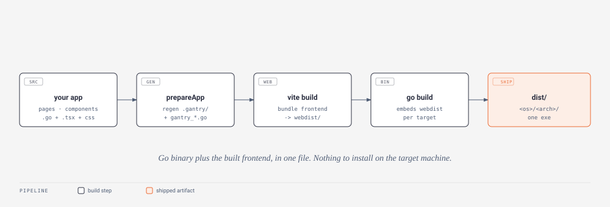

# Project & build commands

The commands that create, build and maintain an app: `new` scaffolds a fresh tree, `build` compiles release artifacts, `install` retrofits optional features, `add` installs npm packages, and `update`/`upgrade` move the CLI and the app to a new release. Every command parses its flags with Go's standard `flag` package, so a flag accepts both `-flag` and `--flag`, and a value can be written `--port 9000` or `--port=9000`; boolean flags take no value (`--tray`, not `--tray=true`). `build`, `add`, `install` and `upgrade` find the app by walking up from the current directory to the nearest `gantry.json`, so they run from anywhere inside the app tree; `new` creates a fresh tree and `update` needs no app at all. Progress output is coloured when the terminal supports it; piping to a file or setting `NO_COLOR` gives plain text.

## gantry new

Scaffolds a new app into `./<name>` (or `<dir>/<name>`). The name becomes the Go module path and the exe name, so it must be a single path-safe word (no spaces or slashes); it is lowercased for the module and title-cased for the window title. The command is interactive by default - every choice has a matching flag, and passing that flag skips its prompt, so a fully-flagged invocation is non-interactive and scriptable. The name can come before or after the flags (`gantry new myapp --multi` or `gantry new --multi myapp`).

```
gantry new <name> [flags]
```

- `--dir D` (string, default: current working directory) - parent directory the app folder is created under.
- `--buttons LIST` (string, default: "") - comma list of titlebar buttons from `minimize,maximize,close`; any subset. Setting it skips all three button prompts (a name absent from the list means that button is off).
- `--tray` / `--no-tray` (bool) - include a system tray, or not. Either flag skips the tray prompt; the tray keeps the app running after the window closes.
- `--single` / `--multi` (bool) - one page, or index + settings + an example component with a shared layout. Either flag skips the pages prompt.
- `--tea` / `--plain` (bool) - page style: UI logic in Go (Tea-style Model/Update/View) or plain React pages with paired Go handlers. Either flag skips the style prompt.
- `--tailwind` / `--no-tailwind` (bool) - set up Tailwind v4 (an `@theme` token `index.css` plus `@tailwindcss/vite` in the synthesized vite config) or a plain-CSS theme. Either flag skips the Tailwind prompt.
- `--port N` (int, default: **8330**) - the local server port, which is also the single-instance guard; written to `gantry.json`.
- `--gantry-dir D` (string, default: `$GANTRY_DIR`, then a silent walk up from the working directory) - path to a local Gantry checkout to depend on (the framework-development workflow). When one is found, `go.mod` and `package.json` link the checkout instead of the published module/npm package.
- `--no-replace` (bool, default: false) - force the published module and npm package even when a local checkout is detected. Private repos then need `GOPRIVATE` set.
- `--no-install` (bool, default: false) - skip the final `npm install`.

### What it generates

`main.go` (window options, tray, roles, registration), `embed.go`, `go.mod`, `package.json`, `tsconfig.json`, `gantry.json`, `index.css` (plain or Tailwind template), `pages/index/` (a starter page with the counter), `pages/index/index.css`, `tests/smoke_test.go`, `.vscode/settings.json` + `.vscode/extensions.json`, `.gitignore`, `README.md`, a placeholder `webdist/index.html`, and real `icons/icon.png` + `icons/icon.ico` seeded from the placeholder glyph. In `--multi` mode it also writes `layouts/main/`, `pages/settings/` and `components/example/`. It also scaffolds agent guidance: `AGENTS.md`, a `gantry` skill at `.claude/skills/gantry/` and `.agents/skills/gantry/` that teaches Claude Code and Codex the framework, and a project-scope `.mcp.json` registering the [gantry-docs MCP server](mobile-and-docs.md#the-mcp-server) so agents can look the docs up as they work. It then generates `gantry_registry.go`, runs `go mod tidy`, and (unless `--no-install`) `npm install`. Swap the icon files for your own art and every surface (exe, window, tray, installer) follows on the next build.

## gantry build



Builds the frontend once, then compiles every configured target into a per-OS/arch release tree under `dist/`:

```
dist/
  windows/amd64/myapp.exe          (windowed app, icon embedded)
  windows/amd64/myapp-setup.exe    (with --installer + Inno Setup installed)
  linux/amd64/myapp                (+ myapp-linux-amd64.tar.gz with --installer)
  mac/arm64/myapp                  (+ myapp-mac-arm64.zip with --installer)
  android/myapp-0.1.0.apk          (with an android target - see the Mobile docs)
```

The pipeline regenerates `.gantry/` and the generated Go files, runs one `vite build` into `webdist/` (the embedded frontend), then runs a `go build` per target. `gantry.json`'s `version` is stamped into the framework via ldflags so the app can read it at runtime (`gantry.Version()` / `useAppInfo()`). Windows exes get `icons/icon.ico` (or `icon.png`) embedded as the executable icon (Explorer, taskbar, shortcuts) automatically when the icons directory exists.

Targets come from `gantry.json`'s `build.targets`, or from `--targets`; with neither, only the current machine's `os/arch` is built. If nothing is built the command errors with "no targets were built".

Flags:

- `--targets LIST` (string, default: "") - comma list of `os/arch` targets, overriding `gantry.json`, e.g. `windows/amd64,linux/arm64`. OS names are `windows`, `linux`, `mac` (aliased from `darwin`), `android`, `ios`. `android` and `ios` may be written bare (both mean `arm64`); android also accepts `amd64`, ios is `arm64` only. A malformed entry errors with the exact bad target.
- `--installer` (bool, default: false; OR'd with `gantry.json` `build.installer`) - also produce install artifacts: an Inno Setup `Setup.exe` on Windows, a `.tar.gz` on Linux, a `.zip` on Mac.
- `--console` (bool, default: false; OR'd with `gantry.json` `build.console`) - keep the console window on Windows builds (without it, Windows targets link `-H windowsgui`). Useful for reading main-process logs from a built exe; child roles always log to `%LocalAppData%\<app>\<role>.log` regardless.

### Cross-compilation and installers

Windows and Mac targets build from any machine (Mac runs in browser-fallback mode, so it is pure Go with `CGO_ENABLED=0`). Linux targets need a Linux machine - on Windows, run `gantry build` inside WSL; non-Linux hosts skip Linux targets with a notice rather than failing. `android` is its own toolchain - see [Android builds](../mobile/android.md); a missing mobile toolchain skips that target with a fix hint while the rest of the run continues. `ios` generates an experimental Xcode scaffold - see [iOS](../mobile/ios.md). On Windows, `--installer` writes a generated `<name>.iss` next to the exe and compiles it to `<name>-setup.exe` when Inno Setup 6's `iscc` is on PATH (or in the standard install locations); without it the `.iss` is left ready to compile.

## gantry install

Retrofits an optional feature into an existing app. Today the only feature is Tailwind v4 - `gantry new --tailwind` does the same for fresh apps, and running it in an app that already has Tailwind is a no-op.

```
gantry install --tailwind [--yes] [--dry-run]
```

Flags:

- `--tailwind` (bool, default: false) - the feature to install. Without it the command errors ("nothing to install - available features: --tailwind").
- `--yes` (bool, default: false) - apply without the diff confirmation prompt.
- `--dry-run` (bool, default: false) - print the `index.css` diff and the planned steps without writing anything.

What `--tailwind` does: migrates `index.css` into the Tailwind structure and shows the diff before writing (an `index.css.bak` backup is kept), installs `tailwindcss@^4` + `@tailwindcss/vite@^4` as devDependencies, sets `"tailwind": true` in `gantry.json`, and regenerates `.gantry/vite.config.ts` with the plugin. A stock scaffold `index.css` is replaced with the standard `@theme` token template; a file with your own colors is kept in full and gains an `@theme` block exposing each custom token as a utility (`--bg-base` becomes `bg-base` via `--color-base`), and any `--gantry-*` chrome variable still holding its scaffold default is re-pointed at your matching token so the window chrome follows your palette.

## gantry add

Installs npm packages into the app, wherever you run it from - a thin `npm install` alias aimed at the app root. Frontend dependencies belong to each app, never to the framework (icon packs, chart libraries, whatever the UI needs). Everything after `add` is passed to `npm install` verbatim, so npm's own flags work.

```
gantry add recharts
gantry add -D @types/node
```

It takes no gantry flags of its own; with no packages it prints its usage.

## gantry update

Updates the gantry CLI itself to the newest release - the built-in replacement for re-running `go install github.com/BlueBeard63/Gantry/cmd/gantry@latest`. It looks up the latest tag on the Go module proxy, reinstalls when you are behind, and on Windows renames the running exe aside first (a running binary cannot be overwritten; the leftover `gantry-old.exe` is cleaned up by the next update). A CLI built from a local checkout is never auto-updated - it tells you to `git pull && go install ./cmd/gantry` from the checkout instead.

```
gantry update
gantry: go install github.com/BlueBeard63/Gantry/cmd/gantry@v0.4.0
gantry: updated v0.3.4 -> v0.4.0
gantry: run gantry upgrade inside your apps to pull the matching template and package changes
```

Flags:

- `--force` (bool, default: false) - reinstall even when already up to date.

## gantry upgrade

Brings the current app up to the running CLI's version - run it inside an app after `gantry update` (or after pulling a new framework release). A release moves the CLI, the Go module and the `gantry-web` npm package in lockstep, and the synthesized frontend entry must match the installed package, so apps should follow in one step rather than piecemeal.

```
gantry upgrade [--yes] [--dry-run] [--force]
```

Flags:

- `--yes` (bool, default: false) - apply every file's default action without prompting.
- `--dry-run` (bool, default: false) - report what would change without writing anything.
- `--force` (bool, default: false) - run even when the app is already recorded at this version.

What it does, in order:

- Bumps the `github.com/BlueBeard63/Gantry` requirement (`go get` + `go mod tidy`) - skipped when `go.mod` `replace`s it with a local checkout.
- Pins `gantry-web` in `package.json` to the exact matching version and runs `npm install` - skipped for `file:` links; the pin is a targeted edit, your other dependencies untouched.
- Re-renders the scaffold templates with the choices recorded in `gantry.json` and compares each against your file: identical files are skipped, missing ones offered for creation, changed ones shown as a diff with a per-file prompt. Tooling files (`tsconfig.json`, `.vscode/`, `.gitignore`, `embed.go`) default to overwrite; files you own (`main.go`, `pages/`, `layouts/`, `components/`, `index.css`, `README.md`) default to keep. `go.mod`, `package.json` and `webdist/index.html` are never re-rendered (the first two were handled surgically above; the third is build output).
- Regenerates the derived files (`.gantry/`, `gantry_registry.go`, `gantry_widgets.go`, `gantry_icons.go`), records the framework version in `gantry.json`'s `gantry` field, and prints any release notes for the versions you crossed.
