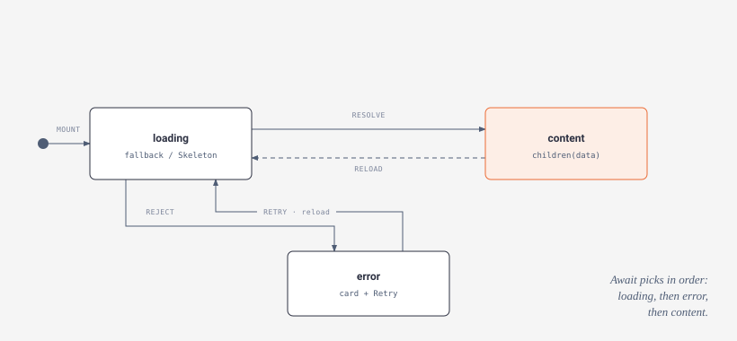

# Await & Skeleton

While a [Go call](calls.md) is in flight you usually want a placeholder, not a blank area, and when it fails you want a retry, not a silent gap. `Await` and `Skeleton` are the two components that turn a `useCall` result into that UI declaratively. `Await` reads the `CallResult` and picks one of three renders - loading, error, or content - and `Skeleton` is the shimmering placeholder you hand it as a fallback. Neither is mandatory: the `loading`/`error`/`data` fields of a [`CallResult`](calls.md#the-callresult-shape) are right there for hand-rolled arrangements. But for the common case these two are one import.



## Await

`Await` is the declarative wrapper around a `useCall` result. It shows your fallback while loading, an error card with a Retry button on failure, and your content once data lands:

```tsx
import { Await, Skeleton, useCall } from "gantry-web";

function Users() {
  const users = useCall<User[]>("api", "listUsers");
  return (
    <Await call={users} fallback={<Skeleton lines={4} />}>
      {(list) => (
        <ul>
          {list.map((u) => <li key={u.id}>{u.name}</li>)}
        </ul>
      )}
    </Await>
  );
}
```

### Props

```ts
interface AwaitProps<T> {
  call: CallResult<T>;
  fallback?: ReactNode;
  renderError?: (error: string, code: string | null, reload: () => void) => ReactNode;
  children: (data: T) => ReactNode;
}
```

- **`call`** (required) - any `CallResult`-shaped object. Usually a `useCall<T>()` result, but anything with the same `{ data, error, code, loading, reload }` shape works.
- **`fallback`** - what to show while `call.loading` is true. Defaults to `<Skeleton lines={3} />`.
- **`renderError`** - custom error rendering, called `(error, code, reload)` when `call.error` is non-null. `error` is the message string, `code` is the [gerr code](../advanced/errors.md) or `null`, `reload` re-runs the call. When omitted, `Await` renders its default error card.
- **`children`** - a render function `(data: T) => ReactNode`, called once with the resolved data. Note `children` is a **function**, not JSX - `data` is `T` (never undefined) inside it.

### What it renders

`Await` branches on the `CallResult` in a fixed order:

1. `call.loading` is true -> renders `fallback` (or the default `<Skeleton lines={3} />`).
2. `call.error !== null` -> renders `renderError(error, code, reload)` if you passed one; otherwise the default card: a `.gantry-await-error` element with the message (`.gantry-await-error-message`), the code when present (`.gantry-await-error-code`), and a `.gantry-await-retry` button wired to `call.reload`.
3. otherwise -> `children(call.data)`.

Because retry is just `call.reload()`, the built-in card and your `renderError` both re-run the exact same call - no extra wiring. Style the default card through those class names, or replace it wholesale with `renderError` when you want branded error UI or to switch on `code`:

```tsx
<Await
  call={me}
  renderError={(msg, code, retry) =>
    code === "auth.expired"
      ? <LoginPrompt />
      : <ErrorCard message={msg} onRetry={retry} />
  }
>
  {(user) => <Profile user={user} />}
</Await>
```

## Skeleton

`Skeleton` renders shimmering placeholder blocks sized like the content they stand in for. It respects `prefers-reduced-motion` (the shimmer is disabled for users who ask for reduced motion).

### Props

```ts
interface SkeletonProps {
  lines?: number;             // placeholder text lines (last renders shorter)
  width?: number | string;    // explicit size for a single block
  height?: number | string;
  circle?: boolean;           // round the block fully (avatars)
  className?: string;
  style?: CSSProperties;
}
```

### Modes

`Skeleton` renders in one of two modes depending on which props you pass:

- **Lines** (the default): `<Skeleton lines={4} />` renders four stacked text lines, the last one shorter (60% width) to look like a paragraph's ragged end. With no props at all it defaults to 3 lines. `lines` takes precedence - if you pass it, you get lines even alongside `width`/`height`.
- **Block**: pass `width`/`height`/`circle` **without** `lines` and you get a single block. `<Skeleton width={240} height={120} />` is a sized block (a chart or image area); `<Skeleton circle />` is a 40x40 avatar (defaults: 40x40, fully rounded). A block without an explicit `width` fills its container; without a `height` it is 16px tall.

`className` and `style` are merged onto the rendered element in both modes, so you can size or space a skeleton to match its slot precisely.

## Hand-rolling without Await

`Await` is a convenience, not a requirement - the `CallResult` fields are enough to arrange loading and error however you like:

```tsx
const users = useCall<User[]>("api", "listUsers");
if (users.loading) return <Spinner />;
if (users.error) return <Banner onRetry={users.reload}>{users.error}</Banner>;
return <UserList users={users.data!} />;
```

Reach for `Await` when the standard loading -> error -> content flow is what you want; drop to the raw fields when the arrangement is unusual (optimistic UI, keeping stale data visible during a `reload`, custom transitions).

## Related

- [Awaited Go calls](calls.md) - `useCall`, the `CallResult` shape these components consume, and the timeout behind an error state.
- [Services & hooks](services.md) - app-level call groups and the `useAuth`-style hooks whose reads you wrap in `Await`.
- [Errors](../advanced/errors.md) - the gerr codes that arrive as `call.code` and the app-wide error pipeline.
