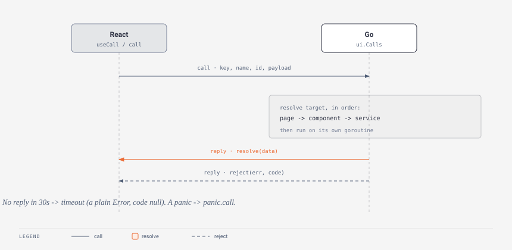

# Awaited Go calls

[Paired handlers](pairs.md) are fire-and-forget: React sends, Go acts, nothing comes back. A **call** is the other half - React asks the Go side a question and `await`s the answer. This page covers the call mechanism itself: how you register a call, the exact shape `useCall` hands back, when `useCall` re-runs, how Go decides which handler answers, what happens when a call panics, and the 30-second timeout that keeps a dead server from leaking promises. For app-wide call groups and the hooks built on them see [Services & hooks](services.md); for the loading and error UI around a call see [Await & Skeleton](await.md).



## Registering a call on a pair

When the tsx needs an ANSWER, give the pair a `Call` alongside (or instead of) its `On`:

```go
// pages/files/files.go
var Page = ui.Page{
    Key: "pages/files",
    Call: ui.Calls{
        "list": func(p json.RawMessage) (any, error) {
            entries, err := os.ReadDir(somewhere)
            if err != nil {
                return nil, err // rejects the promise with this message
            }
            return names(entries), nil // resolves the promise
        },
    },
}
```

```tsx
// pages/files/files.tsx
const { call } = usePaired();
const files = await call<string[]>("list");
```

`ui.Calls` is `map[string]func(payload json.RawMessage) (any, error)`. The `json.RawMessage` is whatever the tsx passed as the payload (undefined when omitted); decode it with `json.Unmarshal` when you need typed fields. The returned value must be JSON-serializable - it is what the promise resolves with. A returned error rejects the promise with that error's message.

Each call runs on **its own goroutine, off the websocket read loop**, so slow work (disk, network, a database round-trip) is fine and never blocks the render pipeline or other calls. (Contrast `On` handlers, which run inline on the read loop and must stay quick - see [Pairs](pairs.md).)

## The CallResult shape

`useCall` is the read-path helper: it runs a call on mount and hands back a `CallResult<T>`. That shape is fixed:

```ts
interface CallResult<T> {
  data: T | undefined;      // the resolved value, undefined until it lands
  error: string | null;     // the failure message, or null
  code: string | null;      // the gerr code of a failed call, or null
  loading: boolean;         // true until the first response (resolve OR reject)
  reload: () => void;       // re-runs the call
}
```

```tsx
const { data: me, loading, error, code, reload } = useCall<User>("auth", "me");
```

A few details that matter:

- `loading` starts `true` and flips to `false` on the **first** settled response, success or failure - it is not "still fetching", it is "no answer yet".
- `data` is `T | undefined`. It holds the last successful value; a later failed `reload()` sets `error` but does not clear `data`.
- `error` is the message string; `code` is the machine-readable [gerr code](../advanced/errors.md) (`auth.expired`, `panic.call`, ...) carried on the `GantryCallError` a rejected call throws. `code` is `null` when the call succeeded, and also `null` for failures that carry no code (including a timeout - see below).
- `reload()` re-runs the same call; it does not take new arguments (change the payload prop to re-fetch with different input).

`useCall(key, name, payload?)` treats a pair key and a service name identically - both are just the first argument. `useCall<User>("auth", "me")` hits the `auth` service; `useCall<string[]>("pages/files", "list")` hits the `files` page's own `Call`.

## When useCall re-runs

`useCall` re-runs the call whenever any of three inputs change: the **key**, the **name**, or the **payload**. Payload identity is compared by value, not reference - internally it is keyed on `JSON.stringify(payload ?? null)`, so a fresh object literal with the same contents does *not* trigger a re-run, and you never need to memoize the payload prop:

```tsx
// Re-fetches only when userId actually changes value.
const profile = useCall<Profile>("api", "profile", { userId });
```

Calling `reload()` forces a re-run without any input changing (it bumps an internal tick). Between mount and the first answer, and on every re-run, `loading` returns to `true` and `error`/`code` reset to `null`. A component that unmounts (or whose inputs change) before an in-flight answer arrives has that answer dropped - stale responses never write into a live result.

## Resolution order: pair before service

React addresses a call by `(key, name)`. Go resolves the target in a fixed order (`App.callHandler` in `ui/app.go`):

1. a **page** whose `Key` equals `key`, if its `Call` has `name`,
2. then a **component** whose `Key` equals `key`, if its `Call` has `name`,
3. then a **service** registered under `key`, if it has `name`.

So a pair's own `Call` always answers before an identically named [service](services.md). In practice pair keys are folder paths (`pages/files`, `components/gauge`) and service names are bare (`auth`, `files`), so collisions are rare - but when a name is reachable both ways, the pair wins. If nothing matches, the call rejects immediately with `no call "<name>" on "<key>"`.

## Panic recovery

Each call runs under a `recover`. A returned error and a panic are handled differently:

- A **returned error** is treated as control flow, not a crash. The promise rejects with the error's message and its [gerr code](../advanced/errors.md) (`gerr.CodeOf(err)`), a breadcrumb is recorded, and that is all - it never reaches the [error pipeline](../advanced/errors.md), so no error banner and no `errHook`.
- A **panic** inside a call is recovered so it cannot take the app down. Gantry logs it, records a breadcrumb, rejects the promise with `panic in <key>.<name>: <value>` and the code **`panic.call`**, and *does* report it to the error pipeline as an `ErrorInfo` (kind `call-panic`, code `panic.call`, with the stack). The websocket survives; the next call answers normally. See [Errors](../advanced/errors.md) for where reported errors surface.

That split is worth internalizing: return an error for the expected failure the caller should handle; a panic is a bug and lights up the full pipeline.

## The 30-second timeout

An unanswered call does not hang a promise forever. `callGo` arms a timer (default **30_000 ms**) when it sends the request; if no reply arrives first, it rejects with a **plain `Error`** whose message is `call <key>.<name> timed out`. This is deliberately *not* a `GantryCallError`, so on a `useCall` result a timeout shows up as an `error` message with `code === null` - there is no gerr code because the failure originated on the frontend, not from a Go handler. The timeout only guards against a wedged or disconnected server; a call that legitimately needs longer than 30s should stream progress over a [paired push](pairs.md) or [shared state](state.md) instead of blocking a single reply.

## Picking between the data paths

- One-way notification ("this happened"): `usePaired().send` + `ui.Handlers` - [Pairs](pairs.md).
- Question with an answer ("give me X", "do this and tell me how it went"): `call` / `useCall` + `ui.Calls` - this page.
- App-wide functionality (auth, settings, dialogs): a [service](services.md) + `useService` / `useCall`.
- A live value both sides own: `useGoState` + `ui.NewState` - [State](state.md).
- Continuous Go-driven UI: a Tea Model - [The Tea model](tea-model.md).

## Related

- [Services & hooks](services.md) - registering app-level call groups and building `useAuth`-style hooks on `useCall`.
- [Await & Skeleton](await.md) - the declarative loading/error wrapper around a `CallResult`.
- [Serving HTTP routes](http-endpoints.md) - when you need a plain HTTP endpoint instead of a websocket call.
