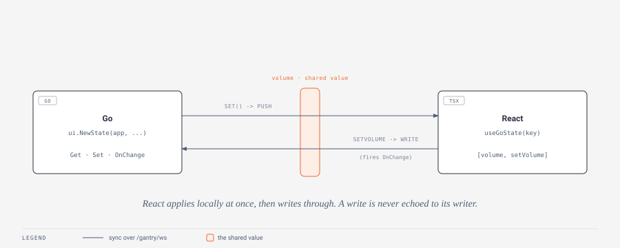

# State

`useGoState` is a `useState` whose value lives in Go and syncs both ways instantly. Reach for it when a value is owned by both sides - volume, active session, feature toggles - and every subscriber should re-render the moment it changes, from React or from Go. For asking Go a one-off question, see [Awaited Go calls](calls.md); for Go-driven UI, a [Tea Model](tea-model.md).



## Declaring shared state in Go

Declare the variable once, at startup, **before the frontend connects**, with `ui.NewState(app, name, initial)`. It is generic, so the value type is inferred from `initial`:

```go
volume := ui.NewState(app, "volume", 0.5) // *ui.State[float64]

volume.Set(0.8)   // stores it and pushes to every React subscriber instantly
v := volume.Get() // current value
volume.OnChange(func(v float64) {
    applyVolume(v) // runs only when REACT wrote the value
})
```

The three methods on `*ui.State[T]`:

- **`Get() T`** - the current value.
- **`Set(v T)`** - stores `v` and pushes it to every connected client immediately. This is your channel for "instant updates" from timers, watchers, and background work.
- **`OnChange(fn func(T))`** - registers an observer that fires **only when the frontend writes the value**. A Go-side `Set()` does *not* trigger it - you made that change, so you already know. Register as many as you like.

## Using it from React

React uses `useGoState(key, fallback)` exactly like `useState`:

```tsx
const [volume, setVolume] = useGoState("volume", 0.5);
<input type="range" value={volume} onChange={(e) => setVolume(Number(e.target.value))} />
```

Every component using the same `key` shares one value, and a set anywhere re-renders them all. A frontend `setVolume` applies **locally at once** (no round-trip lag) and writes through to Go, firing Go's `OnChange` observers; the write is mirrored to any other connected client but never echoed back to the writer. A Go-side `Set()` pushes to the frontend immediately.

The `fallback` argument is the value the hook returns only in the brief moment before the socket delivers the real one - see the note below.

## Notes

- **First render is correct.** A fresh or reconnected client receives a snapshot of every declared state before anything else, so `useGoState` reflects the true Go value from the first render that follows the connect - the `fallback` argument only covers the instant before the socket connects. This is why you declare states with `ui.NewState` before the window opens.
- **Undeclared keys are dropped.** A frontend write to a key that no `ui.NewState` declared is logged (`setstate for unknown state ...`) and discarded rather than silently created. Declare every shared value on the Go side.
- **Values must be JSON-serializable.** State crosses the wire as JSON; a value that fails to marshal (on either side) is logged and skipped rather than crashing.
