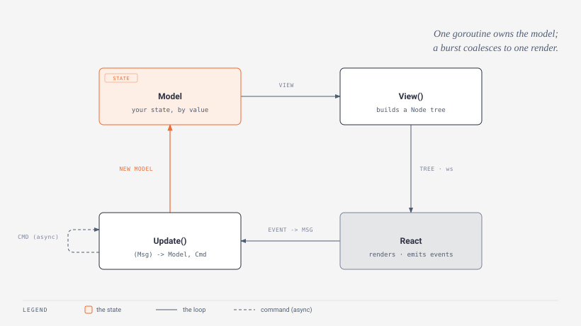

# The Tea model

A page can keep its whole UI - state, logic, and structure - in Go, with React as the renderer. The shape comes from Elm by way of Bubble Tea: a `Model` with three methods, driven by one serialized loop. This page covers that loop - the `Model` interface, how a page registers one, the update cycle, render coalescing, and the panic codes that keep the loop alive. Its two siblings cover what the loop produces and what feeds it: [The node tree](tea-nodes.md) for every `View` builder, and [Commands & messages](tea-commands.md) for every way work re-enters the loop.



## The Model interface

```go
// ui/program.go
type Model interface {
    Init() Cmd                     // first command to run when the page activates (or nil)
    Update(msg Msg) (Model, Cmd)   // fold one event into a new model, optionally scheduling more work
    View() Node                    // render the current state as a tree
}
```

One loop drives it: something happens (a click, a timer, your server) -> it becomes a `Msg` -> `Update` folds it into a new `Model` -> `View` renders that model -> the tree travels to React over the websocket. You never mutate state outside `Update`, and `Update` runs on a single goroutine per page, so there are no data races to reason about. The `Msg` and `Cmd` types and every builder `View` returns live on the sibling pages; this page is about the machine that ties them together.

Models are held and returned **by value**. `Update` takes a copy of the model, changes it, and returns the new one - the loop keeps whatever you return. That is why the signature returns a `Model` rather than mutating in place: the framework, not your code, owns the current state.

## Registering the page

The `.go` half of a `pages/<name>/` folder exports a `ui.Page`. Setting its `Model` field turns the page into a Tea page:

```go
// ui/app.go
type Page struct {
    Key   string           // "pages/stats" - must match the paired .tsx folder
    Route string           // optional; empty derives it from Key ("pages/index" -> "/")
    Model func() Model      // set this for a Tea page
    On    Handlers          // paired events from the tsx (usePaired().send)
    Call  Calls             // paired calls the tsx awaits (usePaired().call)
}
```

`Model` is a **factory** (`func() Model`), not a model value, and it is called **once, lazily, the first time the page becomes active** - never at startup. That single call is where per-page setup belongs: opening a resource, capturing the `*App`, seeding initial state. The app creates the page's `program` on first activation and caches it (`App.program`), so a page the user never visits never builds a model, and a page visited twice keeps the state it had.

```go
var Page = ui.Page{
    Key:   "pages/stats",
    Model: func() ui.Model { return model{} }, // called once, on first activation
}
```

The `.tsx` half is one line of hosting - drop a `TeaView` where the tree goes. It does not have to stay one line; wrap `TeaView` in any React layout you like, since it only renders the current page's Go-built tree:

```tsx
import { TeaView } from "gantry-web/tea";
export default function Stats() { return <TeaView />; }
```

`TeaView` subscribes to render frames for the active page and renders `null` until the first tree arrives - so pages without a `Model` simply never mount one.

## A complete page

```go
package stats

import (
    "time"

    "github.com/BlueBeard63/Gantry/ui"
)

var Page = ui.Page{
    Key:   "pages/stats",
    Model: func() ui.Model { return model{} },
}

type model struct {
    seconds int
    running bool
}

type startStop struct{}
type tick time.Time

func tickCmd() ui.Cmd {
    return ui.Tick(time.Second, func(t time.Time) ui.Msg { return tick(t) })
}

func (m model) Init() ui.Cmd { return nil }

func (m model) Update(msg ui.Msg) (ui.Model, ui.Cmd) {
    switch msg.(type) {
    case startStop:
        m.running = !m.running
        if m.running {
            return m, tickCmd()
        }
    case tick:
        if m.running {
            m.seconds++
            return m, tickCmd() // re-arm the timer
        }
    }
    return m, nil
}

func (m model) View() ui.Node {
    label := "Start"
    if m.running {
        label = "Stop"
    }
    return ui.Column(
        ui.Heading("Session"),
        ui.Textf("%02d:%02d", m.seconds/60, m.seconds%60),
        ui.Button(label, startStop{}),
    ).WithProps("pad", 16, "gap", 12)
}
```

The `View` here uses builders and the `WithProps` modifier documented on [The node tree](tea-nodes.md); the `Tick` command and the `startStop`/`tick` messages are documented on [Commands & messages](tea-commands.md).

## Init and the first render

`Init() Cmd` returns the first command, run once when the page's program starts (in `loop`, right after the `Model` factory produced the model). Return `nil` when there is nothing to kick off, or a load/subscribe command to prime the page:

```go
func (m model) Init() ui.Cmd { return loadCmd("data/config.json") }
```

There is no unconditional first render from `Init`. The very first `View` is delivered when the page activates and a client attaches (delivery is switched on with an internal re-render request), so `Init` and activation never race to paint two initial trees. `Init` returns a `Cmd`, so its mechanics - what a command is and how its result re-enters `Update` - belong to [Commands & messages](tea-commands.md#init).

## The update loop

One goroutine per page owns the model. It is the only thing that ever touches `m`, which is what removes the data races: `Update`, the command scheduler, and rendering are all serialized through it.

```go
// ui/program.go (loop, condensed)
func (p *program) loop() {
    p.runCmd(p.model.Init())
    for {
        select {
        case <-p.stop:
            return
        case msg := <-p.msgs:
            changed := p.apply(msg)
        drain:
            for {
                select {
                case more := <-p.msgs:
                    if p.apply(more) { changed = true }
                default:
                    break drain
                }
            }
            if changed { p.render() }
        }
    }
}
```

`apply` folds one message into the model and reports whether a render is due: an ordinary `Msg` runs `Update` and returns `true`, an internal re-render request returns `true` without touching the model, and a batch fans its commands out and returns `false` (a batch alone changes nothing to paint). Messages arrive on a buffered channel and are fed in by `send`, which every source - `Update`'s own commands, event handlers, and external senders - funnels through.

## Render coalescing

The loop **coalesces**. After it applies one message it drains every message already queued on the channel before it renders once, so a burst of rapid events produces a single render instead of a full-tree send per event - ten quick clicks paint once, not ten times. Only if at least one drained message reported a change does `render` run.

`render` calls `View`, serializes the tree with a fresh handler generation, and delivers it to the active client if one is attached (`deliver` is `nil` while the page is inactive, so an off-screen page keeps updating its model but sends nothing). Trees are small - this is a desktop app, not a million-row grid - so full-tree sends are cheap; if a page ever outgrows that, split it into [custom components](custom-components.md) rather than diffing by hand. The handler generation that `render` mints on every frame - and why the *previous* generation is retained so an event racing an in-flight re-render still resolves - is detailed under [handler generations](tea-commands.md#how-handlers-are-generated-and-retained).

## Panics are contained per stage

A panic in your model code never kills the page loop. Each of the three stages recovers independently, and all three route into the [error pipeline](../advanced/errors.md) with a distinct code:

| Stage | Code | On panic |
| --- | --- | --- |
| `Update` | `panic.update` | the message is dropped and the model keeps its **last good state** (the panicking `Update` return is discarded); no render for that message |
| `View` | `panic.view` | the frame is **skipped** - no tree is delivered for that render, the last delivered tree stays on screen |
| `Cmd` | `panic.cmd` | the command goroutine recovers and the panic is **reported**; no result message is fed back |

Because `Update` recovers to the last good model, a single bad message cannot corrupt the page - the loop keeps running and the next message is applied against the state from before the panic.

## Notes

- **The node tree** - every builder, modifier, and style hint: [The node tree](tea-nodes.md).
- **Commands & messages** - `Msg`/`Cmd`, `Batch`/`Tick`, `App.Send`, `ParamsMsg`, handler generations: [Commands & messages](tea-commands.md).
- **On the wire** - the exact render/event message shapes: [The protocol](../advanced/protocol.md).
- **Deep internals** - the program loop, handler generations, delivery to observers: [Architecture](../advanced/architecture.md).
